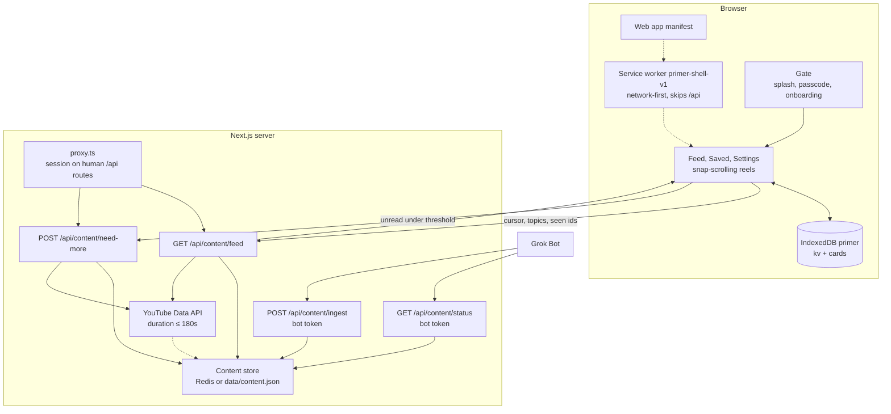

# Architecture

Primer is one Next.js app for a single owner. The browser keeps the library. The server stores a content bank that Grok Bot fills ahead of time. When a passcode is set, the human routes check the session. There is no account system. The app does not call an LLM and does not generate images.

## Client PWA

`src/app/manifest.ts` makes the app installable: standalone display, start URL `/`, theme `#0e0d0b`, and icons in `public/icons` (192, 512, and a maskable 512). `src/app/layout.tsx` registers those icons and a dark viewport.

Pages are `/` (the feed), `/saved`, and `/settings`. A client `AppStateProvider` wraps all of them. `Gate` shows a splash for at most two seconds, then the passcode screen if the server says a passcode is required, then onboarding until a profile is saved, then the page. The shell is a full-height column (max 480px) with a bottom nav; a wide screen also shows an interest summary beside it. Reels snap one viewport at a time. The feed prefetches when the active card is within three of the end.

`ServiceWorkerRegister` calls `navigator.serviceWorker.register("/sw.js")` only when `NODE_ENV` is `production`, so dev hot reload is not cached.

Text reels show bullets and an optional body, plus the takeaway. Diagram reels render the card's `mermaid` string in the browser with Mermaid (`securityLevel: "strict"`, dark theme variables). There is no image-generation path and no Wikimedia card.

Video reels use the YouTube IFrame Player API on `https://www.youtube-nocookie.com` (`enablejsapi=1`, `controls=0`, `playsinline=1`, `rel=0`, `iv_load_policy=3`, `fs=0`, `disablekb=1`, no `modestbranding`). The feed's active card — an IntersectionObserver on the snap scroller, ratio at least 0.6 — is the playback signal. The snapped clip plays, the one you scroll off pauses, and the next video card is the only extra iframe. Autoplay is muted. The sound control unmutes the rest of the session when the browser allows it, and that attempt falls back to muted when it does not. The iframe is anchored to the bottom-right and cropped from the top and left so the picture covers the reel; our controls leave that corner clear so the YouTube logo stays visible and tappable. Channel name and a Watch on YouTube link sit under the player. There is no poster step.

## Service worker and caching

`public/sw.js` uses the cache name `primer-shell-v1`. On install it precaches `/`, `/saved`, `/settings`, the manifest, and the two main icons. On activate it deletes any other cache names.

Fetches are network-first. The worker ignores non-GET requests, other origins, and any path under `/api/`. A successful same-origin GET is stored in `primer-shell-v1`. If the network fails, it serves the cached response, or `/` for a navigation, or a 503. Lesson text you have already opened can load offline. New cards still need the content API. Saved cards themselves live in IndexedDB, not in this cache.

## IndexedDB stores

The database is `primer`, version 1, opened from `src/lib/idb.ts`.

| Store | Key | Contents |
| --- | --- | --- |
| `kv` | `"profile"` | `{ onboarded, interests[] }` with topic, weight 1–5, and depth |
| `kv` | `"queue"` | Ordered card ids for the feed |
| `cards` | `id` | The reel plus `liked`, `saved`, `savedAt`, `known`, and `seenAt` |

`loadLibrary` reads all three in one transaction. Likes, saves, “already know,” and seen marks update a single card. “Clear read reels” keeps saved cards. “Erase” clears both stores.

If `indexedDB.open` errors, is blocked, or takes longer than 1.5 seconds, IndexedDB is disabled for that page session and reads return an empty library. The UI still starts. Writes in that session are skipped.

Unread count is the queue entries that have no `seenAt`. When that count is under `REFILL_UNREAD_THRESHOLD` (default 20), the feed client posts `/api/content/need-more` at most once a minute.

## Content bank

`src/lib/content-store.ts` holds one document: `{ cards, signals }`.

Cards are zod-checked. A card has `id`, `type` (`text`, `diagram`, or `video`), `topic`, `depth`, `title`, and `createdAt`. Text and diagram cards need a takeaway. Text cards need 3–6 bullets or a body of at least 40 characters. Diagram cards need `mermaid`. Video cards need an 11-character `youtubeId`, `channelTitle`, and `durationSeconds` from 1 to 180. A video takeaway is optional. Image cards are rejected.

Lessons stay in `createdAt` order. `weaveFeed` then inserts a video after every five lessons, so a full page of six is about one video when the bank has one. `cursor` is the last card id in that woven list. `topics` (repeatable) limits the page to the reader's interests. `exclude` drops ids this browser already has. `topic` plus `deeper=1` returns unseen lesson cards on that topic, higher depth first, and does not spend a YouTube search. If that page is empty, the client posts a `deeper` signal so the next Grok Bot refill can prefer the topic. A deeper signal does not by itself set `needsRefill`.

Signals are the app's note to Grok Bot. A `queue-low` signal replaces the previous one and carries `unread`, interests, known topics, and seen counts. `needsRefill` is true only when that reported unread count is under the threshold. `POST /api/content/ingest` upserts by id and clears signals, so the bot should read status before it pushes.

## Store

| Mode | When | What persists |
| --- | --- | --- |
| File | `KV_REST_API_URL` / `KV_REST_API_TOKEN` are unset | `data/content.json`, or `CONTENT_DATA_PATH` |
| Redis | Those variables are set, or the `UPSTASH_REDIS_REST_*` aliases | One JSON value at key `primer:content` |

The file is the local and demo seed, and it is writable on a normal machine. Vercel's serverless filesystem does not keep writes, so production ingest needs Redis. Upstash Redis through the Vercel Redis / KV integration is on the free tier and speaks HTTP, which fits a serverless route. If Redis has no value yet, the route seeds it from `data/content.json` on the next read. A read-only filesystem returns 503 from ingest and need-more with that explanation.

Demo mode is `CONTENT_BOT_TOKEN` unset. `GET /api/content/feed` still serves the seed. Ingest and status return 401 until the token is set. `GET /api/config` reports `{ mode: "demo" | "bank", store, refillThreshold, total, youtube }` and no secrets.

## YouTube curator

`src/lib/youtube.ts` runs only when `YOUTUBE_API_KEY` is set. The key stays in the server process. `GET /api/content/feed` (except deeper) and `POST /api/content/need-more` call `topUpShortVideos` when fewer than two unseen video cards remain for the requested topics. Unseen means a video whose id is not in the client's `exclude` list. Need-more has no exclude list, so it counts videos still in the bank.

The search uses `type=video`, `videoEmbeddable=true`, and `videoDuration=short`, then loads `contentDetails.duration`. `parseIso8601Duration` and `filterByDuration` keep a positive length of at most 180 seconds. Anything longer, unparseable, or duplicated by `youtubeId` is dropped. New cards are merged into the bank without clearing Grok Bot's refill signals. Ids are `yt_` plus the video id, so the same clip is not stored twice.

A topic's result is cached for 10 minutes. A process makes at most one search burst a minute and 24 searches per UTC day. The counters are in memory and reset on restart. If the key is missing or a call fails, the feed continues with the cards already in the bank. Grok Bot can also push video cards through ingest; the curator is the other path, not a replacement.

## API routes

| Route | Who | Role |
| --- | --- | --- |
| `GET /api/auth/status` | Public | `{ required, unlocked }` from the env and the session cookie |
| `POST /api/auth/unlock` | Public | Checks `APP_PASSCODE`, sets the cookie. Eight tries per minute per IP |
| `POST /api/auth/logout` | Public | Clears the cookie |
| `GET /api/config` | Session | `{ mode, store, refillThreshold, total, youtube }` |
| `GET /api/content/feed` | Session | Next cards. Query: `cursor`, `limit` (1–20), `topics`, `exclude`, optional `topic` and `deeper=1` |
| `POST /api/content/need-more` | Session | Records a low-queue or deeper preference |
| `GET /api/content/status` | Bot token | `{ total, needsRefill, unreadReported, deeperTopics, signals }` |
| `POST /api/content/ingest` | Bot token | Zod-validated batch, upsert by id, clear signals |

`src/proxy.ts` runs on `/api/:path*`. If `APP_PASSCODE` is unset, every API request proceeds. If it is set, every API path except `/api/auth/*`, `/api/content/ingest`, and `/api/content/status` needs a valid session or the proxy returns 401. Ingest and status skip the session check and require `Authorization: Bearer $CONTENT_BOT_TOKEN` instead. The feed pages themselves are not behind the proxy; the client hides them until unlock.

## Passcode gate

`APP_PASSCODE` empty means the app is unlocked. When it is set, `POST /api/auth/unlock` compares the submitted passcode and, on a match, sets the `primer_session` cookie: HMAC-SHA256 over the expiry, signed with the passcode, httpOnly, `SameSite=Lax`, 30 days, and `Secure` in production. `verifySessionToken` checks the signature and the expiry. Wrong attempts are limited to eight per minute per IP. The feed client treats a 401 as a local lock and shows the passcode screen again.

The bot token is a separate secret. It is compared with a timing-safe equality check and is never sent to the browser.

## Demo mode

`data/content.json` ships text and Mermaid cards for LLMs, Agentic AI, and System Design, plus two short YouTube clips (Fireship, under three minutes) so demo mode has a video reel with no API key. The same zod schema checks the seed, an ingest batch, and a Redis document.
