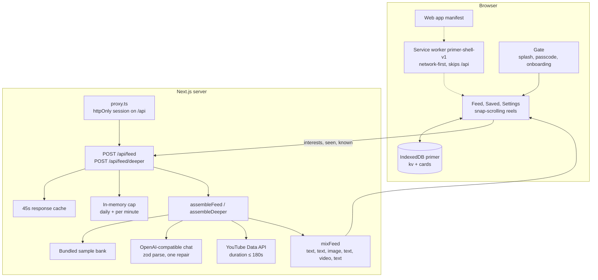

# Architecture

Primer is one Next.js app for a single owner. The browser keeps the library. The server generates cards and, when a passcode is set, checks the session. There is no account system and no database.

## Client PWA

`src/app/manifest.ts` makes the app installable: standalone display, start URL `/`, theme `#0e0d0b`, and icons in `public/icons` (192, 512, and a maskable 512). `src/app/layout.tsx` registers those icons and a dark viewport.

Pages are `/` (the feed), `/saved`, and `/settings`. A client `AppStateProvider` wraps all of them. `Gate` shows a splash for at most two seconds, then the passcode screen if the server says a passcode is required, then onboarding until a profile is saved, then the page. The shell is a full-height column (max 480px) with a bottom nav; a wide screen also shows an interest summary beside it. Reels snap one viewport at a time. The feed prefetches when the active card is within three of the end.

`ServiceWorkerRegister` calls `navigator.serviceWorker.register("/sw.js")` only when `NODE_ENV` is `production`, so dev hot reload is not cached.

## Service worker and caching

`public/sw.js` uses the cache name `primer-shell-v1`. On install it precaches `/`, `/saved`, `/settings`, the manifest, and the two main icons. On activate it deletes any other cache names.

Fetches are network-first. The worker ignores non-GET requests, other origins, and any path under `/api/`. A successful same-origin GET is stored in `primer-shell-v1`. If the network fails, it serves the cached response, or `/` for a navigation, or a 503. Lesson text you have already opened can load offline. New generation still needs the server. Saved cards themselves live in IndexedDB, not in this cache.

## IndexedDB stores

The database is `primer`, version 1, opened from `src/lib/idb.ts`.

| Store | Key | Contents |
| --- | --- | --- |
| `kv` | `"profile"` | `{ onboarded, interests[] }` with topic, weight 1–5, and depth |
| `kv` | `"queue"` | Ordered card ids for the feed |
| `cards` | `id` | The reel plus `liked`, `saved`, `savedAt`, `known`, and `seenAt` |

`loadLibrary` reads all three in one transaction. Likes, saves, “already know,” and seen marks update a single card. “Clear read reels” keeps saved cards. “Erase” clears both stores.

If `indexedDB.open` errors, is blocked, or takes longer than 1.5 seconds, IndexedDB is disabled for that page session and reads return an empty library. The UI still starts. Writes in that session are skipped.

## API routes

| Route | Role |
| --- | --- |
| `GET /api/auth/status` | `{ required, unlocked }` from the env and the session cookie |
| `POST /api/auth/unlock` | Checks `APP_PASSCODE`, sets the cookie. Eight tries per minute per IP |
| `POST /api/auth/logout` | Clears the cookie |
| `GET /api/config` | `{ mode, youtube, aiImages, dailyCap, usedToday }`. No secrets |
| `POST /api/feed` | Next batch |
| `POST /api/feed/deeper` | Up to three follow-up cards for one reel |

`src/proxy.ts` runs on `/api/:path*`. If `APP_PASSCODE` is unset, every API request proceeds. If it is set, every API path except `/api/auth/*` needs a valid session or the handler returns 401. The feed pages themselves are not behind the proxy; the client hides them until unlock, and generation cannot run without the cookie.

## LLM generation pipeline and schema validation

Used only when `LLM_API_KEY` is set. `src/lib/llm.ts` POSTs to `{LLM_BASE_URL}/chat/completions` (`LLM_BASE_URL` defaults to `https://api.openai.com/v1`, `LLM_MODEL` to `gpt-4o-mini`). The key stays in the server process. The prompt lists interests with a target depth, recent titles to avoid, and concepts the reader marked as known. The model must return JSON only. It must not invent YouTube ids.

`parseGeneratedBatch` in `src/lib/schema.ts` pulls JSON out of the reply (including a fenced block) and checks it with zod. A text card needs 3–6 bullets or an explanation of at least 40 characters. An image card needs `imageUrl`, `mermaid`, or `imagePrompt`, plus a caption. A video card needs an 11-character `youtubeId` and, when present, `durationSeconds` of at most 180. Stable ids are assigned with a hash of type, topic, and title.

If validation fails, the same chat is retried once with the bad reply and the zod error, asking for corrected JSON. A second failure becomes a 502. Image cards that only have `imagePrompt` are dropped unless `ENABLE_AI_IMAGES=true`, in which case the server calls `{LLM_BASE_URL}/images/generations` (`LLM_IMAGE_MODEL`, default `dall-e-3`). Mermaid source is rendered in the browser, not on the server.

`assembleFeed` asks for lesson cards and YouTube candidates together, then `mixFeed` fills the batch. The slot pattern is text, text, image, text, video, text. Topic choice is weighted by interest weight and reduced when that topic was marked known. Depth steps from beginner to intermediate to advanced after every six seen cards on that topic. Titles that are too similar to recent ones are skipped.

## YouTube curation

`src/lib/youtube.ts` runs only when `YOUTUBE_API_KEY` is set. It searches at most two interest topics, with `type=video`, `videoEmbeddable=true`, and `videoDuration=short`, then loads `contentDetails.duration`. `filterByDuration` keeps clips whose ISO 8601 duration parses to a positive length of at most 180 seconds. Anything longer, unparseable, or errored is dropped, so a missing key or a failed call simply means that batch has no new video cards. The player is a `youtube-nocookie.com` iframe mounted only while that reel is active and Play has been tapped.

Demo mode does not call YouTube. Sample video cards already point at checked clips under three minutes.

## Passcode gate

`APP_PASSCODE` empty means the app is unlocked. When it is set, `POST /api/auth/unlock` compares the submitted passcode and, on a match, sets the `primer_session` cookie: HMAC-SHA256 over the expiry, signed with the passcode, httpOnly, `SameSite=Lax`, 30 days, and `Secure` in production. `verifySessionToken` checks the signature and the expiry. Wrong attempts are limited to eight per minute per IP. The feed client treats a 401 as a local lock and shows the passcode screen again.

## Rate limit and daily cap

`src/lib/rate-limit.ts` keeps one in-memory bucket for the Node process (it resets on restart and is not shared across instances). `GENERATION_DAILY_CAP` defaults to 40 generations per UTC day. `RATE_LIMIT_PER_MINUTE` defaults to 8. Over the cap, `/api/feed` returns 429 with `Retry-After`. Saved reels still open, because they are local.

`POST /api/feed` checks the 45-second response cache before calling `consumeGeneration`. A repeated identical request does not spend the cap. Demo mode, when `LLM_API_KEY` is unset, does not call `consumeGeneration` at all.

## Demo mode

`llmConfigured()` is false when `LLM_API_KEY` is missing. `assembleFeed` then calls `buildDemoBatch`, which mixes `DEMO_CARDS` (text, Mermaid, one Wikimedia image, and short sample videos) with the same `mixFeed` rules. Custom topics that are not in the bank get a small synthetic set. `assembleDeeper` prefers curated deeper cards for that topic, then synthetic follow-ups, and returns at most three. The JSON body includes `source: "demo"` or `source: "live"`.
